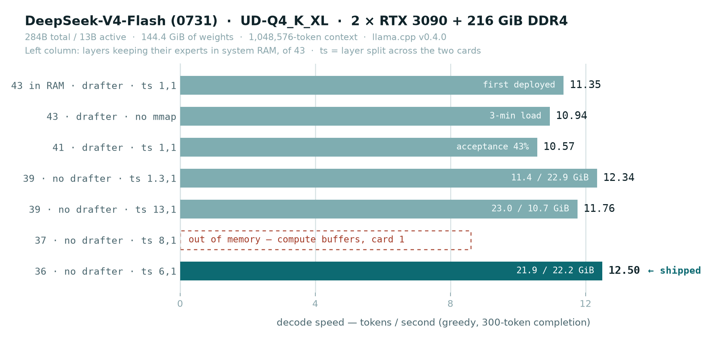

# DeepSeek-V4-Flash on the `inference` box

**TL;DR — a 284B mixture-of-experts model runs at its full 1M-token context on 48 GB of VRAM,
answering at 12.5 tokens/second, by keeping 36 of 43 layers' experts in system RAM.**

Measured 2026-09-16. Full record in [`SPEC-bigmoe.md`](../SPEC-bigmoe.md) §15.

## What is being served

| | |
|---|---|
| **Model** | **DeepSeek-V4-Flash**, `0731` checkpoint — 284B total / 13B active, MIT |
| **Quant** | **`UD-Q4_K_XL`** (unsloth dynamic 4-bit), 5 shards, **144.4 GiB** on disk |
| **Repo** | `unsloth/DeepSeek-V4-Flash-0731-GGUF` |
| **Runtime** | llama.cpp **v0.4.0** (build `b1-5266f24`), `llamacpp-v4` image, behind llama-swap |
| **GPUs** | 2 × RTX 3090 (~46.6 GiB usable, no NVLink). The three A2000s are reserved for other workloads |
| **Host** | 216 GiB DDR4; weights mmap'd from the `/fast` NVMe mirror |
| **Model ID** | `deepseek-v4-flash` — whole-box entry, runs alone, any other request evicts it |

## Capability

| Metric | Measured | Target (§8) |
|---|---|---|
| Decode, single stream | **12.5 tok/s** | ≥ 8 ✅ |
| Prefill, 6k-token prompt | **304 tok/s** | ≥ 100 ✅ |
| Context | **1,048,576 tokens**, 1 slot, f16 KV | native max |
| VRAM | 21.9 + 22.2 = **44.1 GiB** | ≤ 44 ✅ |
| Host RAM | ~155 GiB, as reclaimable page cache | ≤ 180 ✅ |
| Warm load | ~7 s | ≤ 90 ✅ |
| Speculative decoding gain | 0.91× | ≥ 1.4 ❌ → drafter dropped |
| Cold load from NVMe | not yet timed | record it |

## The tuning trials



All runs: same prompt, 300-token completion, greedy sampling (`temperature 0`). Greedy matters —
at temperature 1.0 the drafter redraws each run and swings throughput by ±7%.

| # | Experts in RAM | Drafter | Layer split | Decode | VRAM card 1 / 2 | Outcome |
|---|---|---|---|---|---|---|
| 1 | 43 of 43 | yes | `1,1` | 11.35 tok/s | 17.3 / 15.8 GiB | first deployed setting |
| 2 | 43 | yes | `1,1` | 10.94 tok/s | — | `--load-mode none`: 3-min load, ate the page cache |
| 3 | 41 | yes | `1,1` | 10.57 tok/s | — | draft acceptance fell to 43% |
| 4 | 39 | no | `1.3,1` | 12.34 tok/s | 11.4 / 22.9 GiB | lopsided |
| 5 | 39 | no | `13,1` | 11.76 tok/s | 23.0 / 10.7 GiB | lopsided the other way |
| 6 | 37 | no | `8,1` | — | — | **out of memory** (compute buffers, card 1) |
| 7 | **36** | **no** | **`6,1`** | **12.50 tok/s** | **21.9 / 22.2 GiB** | **balanced — shipped** |

### What the trials settled

1. **The DSpark drafter costs more than it returns.** Its 10.1 GiB of VRAM buys 11.35 tok/s; the
   same VRAM spent on expert layers buys 12.50. Acceptance measured 43–51% (mean draft length
   2.3–2.5) against the 1.5–1.9× the model card advertises. Dropped.
2. **Balancing the cards matters more than the layer count.** llama.cpp assigns layers in order,
   so the GPU-resident expert layers land on the last card. Both OOMs came from that imbalance,
   not from a VRAM shortage. `tensor_split` is what fixes it.
3. **Below ~39 layers in RAM nothing improves** — 36 and 39 measure the same. Expert compute on
   12 CPU threads is as much the limit as DDR4 bandwidth, so shaving the RAM share further will
   not help; more cores or more GPU would.
4. **Context is nearly free here.** Every layer caches only a 128-token window; only the
   compressed caches (one entry per 4 or per 128 tokens) grow. The full 1M costs ~7 GiB.
5. **llama.cpp's own `--load-mode none` hint is wrong on this box.** The page cache is already
   warm, and the flag moved 138 GiB out of reclaimable cache (available RAM 201 → 61 GiB).

### Rejected: drafter on a spare GPU

Parking the drafter on an A2000 would have kept both speculation and the expert layers. It
aborts: a coupled DSpark/DFlash drafter cannot own a device
([ggml-org/llama.cpp#26475](https://github.com/ggml-org/llama.cpp/issues/26475), open, reported
on this same model). The A2000s are reserved for other workloads anyway.

## Reading these numbers fairly

- **Single stream, one slot.** 12.5 tok/s is what one conversation gets; concurrency is untested.
- **Thinking is on by default.** The model spends its first tokens reasoning, so a short
  `max_tokens` can return empty content. Budget tokens, or send
  `{"chat_template_kwargs": {"enable_thinking": false}}`.
- **Prefill was measured at 6k tokens.** At 304 tok/s a 500k-token prompt is still ~27 minutes
  before the first output token. The 1M context is capacity, not an interactive workflow.
- **Untested:** tool calling (DSML), long-context coherence, cold-load time.

## Reproducing

```bash
# chart
python -m venv .venv && .venv/bin/python -m pip install matplotlib
.venv/bin/python docs/plot_dsv4.py

# one benchmark run against the deployed model
curl -s http://127.0.0.1:9292/v1/chat/completions -H 'Content-Type: application/json' \
  -d '{"model":"deepseek-v4-flash","messages":[{"role":"user","content":"Write 300 words about PCIe."}],
       "max_tokens":300,"temperature":0,"top_p":1,"chat_template_kwargs":{"enable_thinking":false}}' \
  | python3 -c 'import json,sys; print(json.load(sys.stdin)["timings"])'
```
